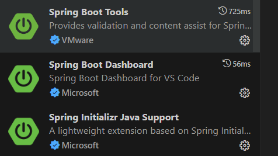

1. Use Spring Initializer to set up the skelton
https://start.spring.io/

2. Add 
        <dependency>
                <groupId>org.springframework.boot</groupId>
                <artifactId>spring-boot-starter-web</artifactId>
        </dependency>
    In pom.xml
3. Install jdk 17.0.10

4. Install plugins in vscode
        Spring boot tools
        Spring boot dashboard
        Spring Initiallizer Java Support
         

        Extention pack for jav
        this will install below extentions
        

5. To run the app

        Run from here in vs code
        

6. References
https://www.youtube.com/watch?v=cjeuIGAkPm4
https://www.youtube.com/watch?v=dq1z9t03mXI

