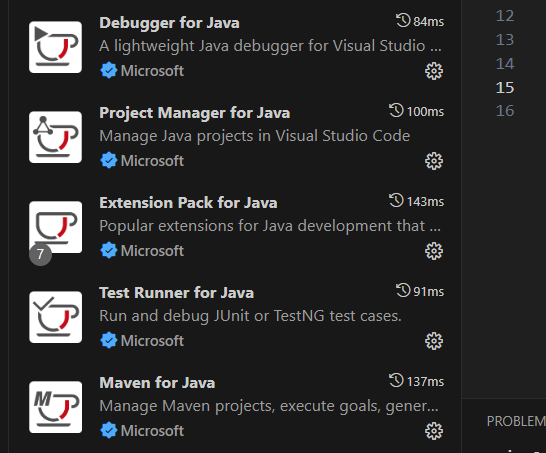
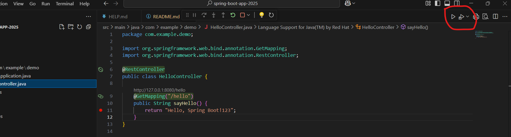

1. Use Spring Initializer to set up the skeleton
                https://start.spring.io/

2. Add the following dependency in `pom.xml`:
                ```xml
                <dependency>
                        <groupId>org.springframework.boot</groupId>
                        <artifactId>spring-boot-starter-web</artifactId>
                </dependency>
                ```

3. Install JDK 17.0.10

4. Install plugins in VS Code:
                - Spring Boot Tools
                - Spring Boot Dashboard
                - Spring Initializer Java Support
                
                - Extension Pack for Java
                This will install the following extensions:
                

5. To run the app:

                Run from here in VS Code:
                